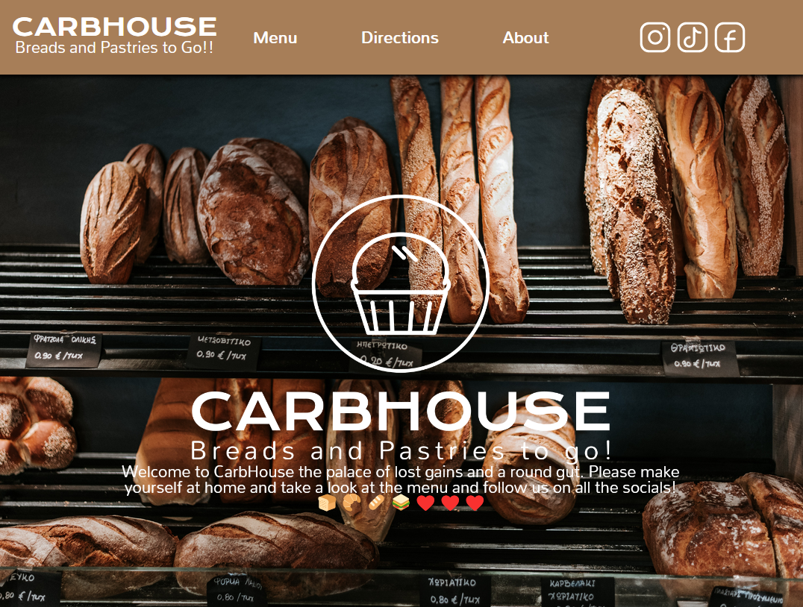

# project-restaurant-page

- [Live Demo](https://dario-cruz.github.io/project-restaurant-page/)

## Objectives:
 - Create a restaurant website making use of webpack.
 - Divide pages and functionality into modules.
 - Import and link related / needed modules.
 - Make use of npm and webpack plugins to convert and optimize code and assets.
 - Learn about webpack/npm configuration and workflow.